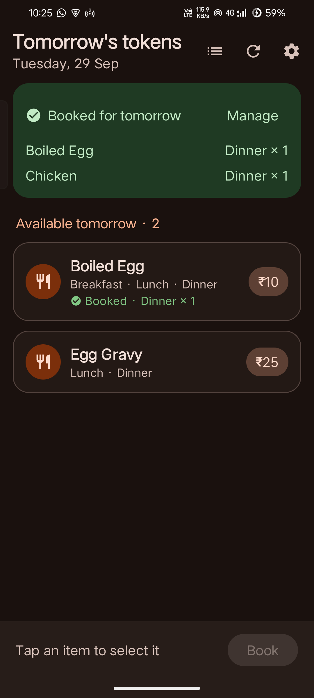
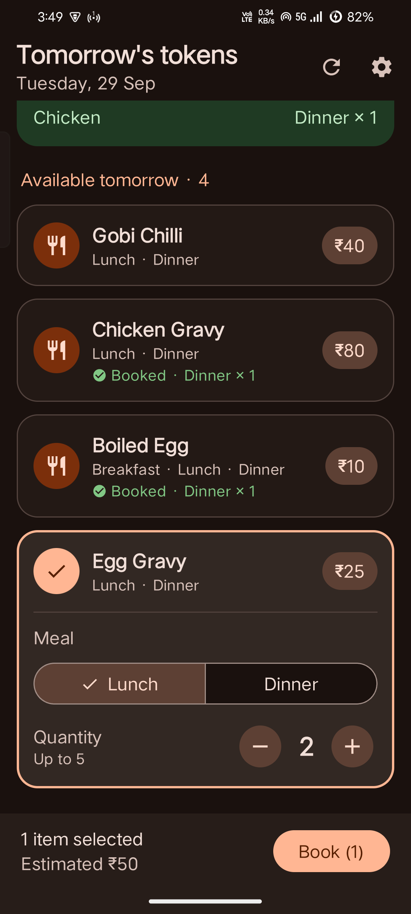
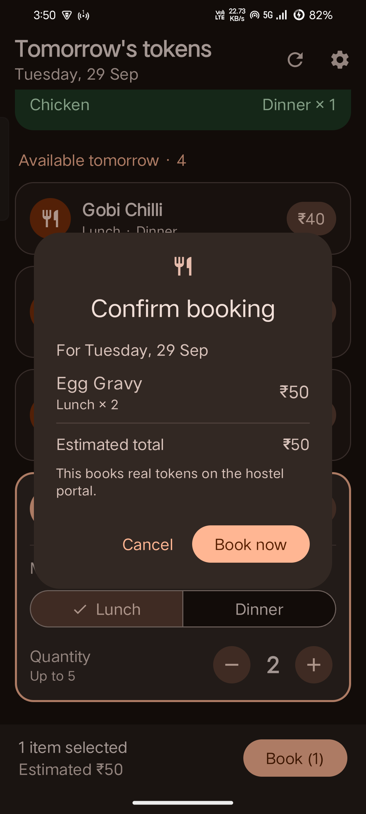
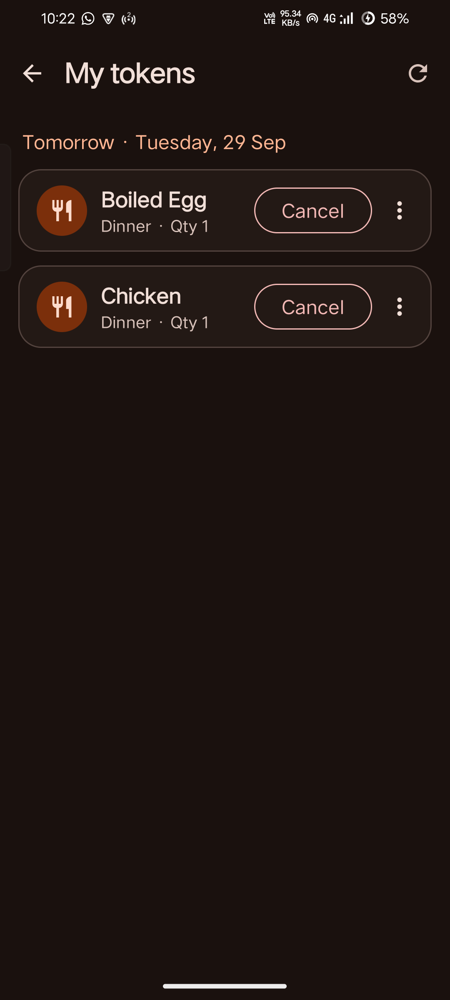

# StayEasy

A small Android and iOS app for PSG Tech hostel students: it reminds you to book tomorrow's food tokens, books them (or upcoming days) in a couple of taps, shows your food QR, and lets you apply for and cancel hostel leave — without opening the portal in a browser. (It used to be called *Book your token*.)

Built with Kotlin Multiplatform: the portal client, parsing, booking/cancel logic **and the whole UI** (Compose Multiplatform) are shared, so both apps behave identically.

> **Unofficial.** Not affiliated with or endorsed by PSG College of Technology. It signs in to the hostel portal with *your own* account, exactly like the website does.

<p align="center">
  
  
  
  
</p>

## Features

- **Daily reminder** at a time you choose (default 4:00 PM — bookings close around 5:30 PM the day before). Shows as a pop-up and follows your ringer: sound in ring mode, vibration in vibrate mode, silent in silent mode.
- **Tomorrow's menu at a glance** — every item on offer for tomorrow, with price, available meals and anything you've already booked.
- **Quick booking** — tap items, pick the meal and quantity (capped at the portal's limit), review the total, confirm.
- **Book ahead** — every upcoming date the portal offers, as a row of date chips (or a calendar with only those dates enabled). Each chip shows the item count, a dot if you already have a booking that day, and how many items you've picked. Pick items across several days, then book them all at once after one confirmation grouped by date. Dates whose booking has likely closed (after 5:30 PM the day before) are dimmed but still bookable, because the portal has the final say.
- **Clear results** — each item shows the portal's own response ("Token Booked", "Token apply time has expired", …).
- **Simple navigation** — six labelled tabs at the bottom: *Tomorrow*, *Ahead*, *Booked* (with a badge counting your upcoming tokens), *QR*, *Leave* and *Settings*.
- **Booked** — everything you've booked, grouped by date, with a Cancel button for tokens that haven't been used yet.
- **Screen-reader friendly** — every button says which token it acts on ("Cancel one Boiled Egg, Dinner"), item cards are announced as checkboxes with their state, quantity changes are read out, settings switches are single controls, and section titles are headings.
- **Skip when already booked** — optionally no reminder on days you've already booked.
- **Food token QR** — once the portal enables a token's QR, a *Show today's QR* button appears (and *Show QR* on that token in Booked). The QR is shown large on white, at full brightness with the screen kept on, above the list of tokens it covers. A copy is kept for when the mess hall has no signal ("Offline copy from 7:42 AM — may be outdated").
- **Hostel leave** — your leave history, newest first, with a coloured status for each (Applied, Approved, Rejected, Cancelled). *Apply for leave* opens a form: leave type and approving staff come straight from the portal (the staff list is searchable and remembers who you picked last), From and To each get a date and a time in 5-minute steps, and the reason only accepts what the portal allows. Leaves that are still *Applied* can be cancelled.
- **Optional "QR ready" notification** (Android, off by default) — one morning check that tells you when your QR is enabled.
- **Greeting** — "Good evening, Soma 👋" at the top of *Tomorrow*. The name comes from the portal (looked up at most once a day, after your tokens have loaded) and can be changed in Settings → *Name in greeting*.
- **In-app updates** (Android) — checks a public GitHub releases repo and offers newer versions with their release notes. *Later* puts a version off for 24 hours; Android's own install screen always asks before anything is installed. Settings has *Check for updates* and *Open releases page*.

### Android vs iOS

Everything above works the same on both, except the daily reminder:

| | Android | iOS |
|---|---|---|
| Reminder | Background job signs in and checks the portal, then notifies ("2 items available for 29-09-2026") | Plain local notification at your chosen time ("Tap to see what's available tomorrow") — iOS doesn't allow reliable background jobs at a set time |
| Skip if already booked | Checked in the background every day | Skipped once the app has seen tomorrow is booked (e.g. after you book) |
| Planning | Reschedules itself daily | Planned two weeks ahead and topped up every time you open the app |
| Check now | Background check → notification | Same check, run while the app is open → notification |
| Credentials | `EncryptedSharedPreferences` | iOS Keychain |
| "QR ready" notification | Optional morning check | Not available — needs a background check at a set time |
| "Show QR" shortcut | Long-press the app icon | — |
| Offline QR copy | App-private `filesDir`, not backed up | App sandbox (Application Support), file protection on, not backed up |

## Safety rules the app follows

- **Nothing is ever booked without you tapping _Book now_.** No auto-booking, no booking from the notification. Book ahead lists every entry, grouped by date, before sending anything.
- **Nothing is cancelled without a confirmation** that names the exact token, meal, date and quantity. "Cancel all" is a separate, clearly-labelled action with its own warning.
- **Credentials stay on your phone**, in `EncryptedSharedPreferences` (Android) or the Keychain (iOS). The password is only ever sent in the portal's own login request — never logged or sent anywhere else.
- **Gentle on the portal**: one background check per day (two if "QR ready" is on), bookings sent one at a time (in date order for Book ahead), no polling. Book ahead reads every upcoming date from the one booking-page fetch, never one request per date.
- **Dates are sent exactly as the portal lists them** — the dropdown's own `dd-MM-yyyy` string — and only sorted by the parsed date.
- **The QR is shown exactly as the portal sends it** — never generated, decoded or altered — and only fetched when the portal says a token's QR is enabled (`ViewStatus == "1"`). The offline copy stays in app-private storage and is deleted once every token it covers is in the past, and on sign-out or sign-in.
- **Leave requests go to a real staff member**, so applying always shows who it goes to, the dates and the reason, and waits for *Send request*. Cancelling a leave asks first too, and warns when another Applied leave has the same dates (the portal matches by date only, so it might cancel either one). Leave types and staff are never hardcoded, and nothing leave-related runs in the background.
- **No blind retries**: if a booking, cancel or leave request gets no response, the app re-reads your bookings or leave history to see whether it registered before telling you anything, and never resends it for you.

## How it talks to the portal

There's no public API, so the app does what the website does, using the same endpoints on `edviewx.psgtech.ac.in`:

| Step | Request | Purpose |
|---|---|---|
| 1 | `GET /Hostel` | Get session cookies |
| 2 | `POST /Hostel/Login/Authenticate` | Sign in (roll number **must be uppercase**) |
| 3 | `GET /Hostel/Student/StudentView` | The booking page — parsed with Jsoup for items, dates and meals |
| 4 | `POST /Hostel/Student/StudentGetToken` | Tokens you've already booked (JSON) |
| 5 | `POST /Hostel/Student/newStudentTokenApply` | Book one item (success: `oresult == 1`) |
| 6 | `POST /Hostel/Student/StudentTokenCancel` | Cancel **one** unit — verified: quantity 2 → 1 (success: `oresult == 0`) |
| 7 | `POST /Hostel/Student/StudentTokenBulkCancel` | The site's "Cancel All" — same payload; verified on a quantity-1 token, behaviour for larger quantities unverified |
| 8 | `GET /Hostel/QRCode/QRcodeGenerate` | The QR page (one per student; the server picks the tokens from the session). Only requested when a StudentGetToken row has `ViewStatus == "1"`. The QR is an embedded `data:image/png` (`alt="QR Code"`); the page's hidden inputs are ignored |

The cancel endpoints identify a token by roll number + name + date + meal, using field names that don't match their contents (the site's JavaScript reads them from table columns by position): `ISSUE_DATE` carries the **token name** and `TOKEN_ID` carries the **date**. See `HostelClient.cancelFormFields` — it's covered by a unit test so nobody "fixes" it.

Hostel leave uses five more endpoints. They only need the login cookie (no StudentView first), and the read calls take `?rollno=` in uppercase:

| Request | Purpose |
|---|---|
| `GET /Hostel/Student/StudLeaveS` | Leave types (`leave_type` is sent, `leave` is shown) |
| `GET /Hostel/Student/StudApprMngr` | Approving staff (`staff_id` is sent as `manager`) |
| `GET /Hostel/Student/StudentGetLeav` | Leave history. Dates are `dd-MM-yyyy hh:mm a`, and rows come back sorted as text, so the app re-sorts them |
| `POST /Hostel/Student/StudentLeavApply` | Apply. Dates `dd/MM/yyyy` (slashes), times `h:mm` with no leading zero plus `AM`/`PM` (success: `oresult == 1`) |
| `POST /Hostel/Student/StudentLeavCancel` | Cancel, using the history row's dashed date part as-is, no times (success: `oresult == 1`) |

The formats really do differ between the calls; [`LeaveFormat.kt`](shared/src/commonMain/kotlin/com/example/bookyourtoken/data/LeaveFormat.kt) holds them, with unit tests. A cancelled leave disappears from the history rather than showing *Cancelled*.

Two things learned the hard way:

- **The login expires after 10 minutes** and can't be refreshed, so the app signs in fresh for every operation instead of keeping a session around.
- **Booking only works in a session that has already loaded steps 3 and 4.** The portal appears to set up per-session state (your balance, mess id) when those pages load; skipping them makes every booking fail with "The remaining balance is required to be paid." even when your balance is fine.

Item IDs and quantity limits aren't in the page HTML — they come from the site's JavaScript and are kept in [`TokenPageParser.kt`](shared/src/commonMain/kotlin/com/example/bookyourtoken/data/TokenPageParser.kt). If the portal changes, that parser is the first place to look; the app shows a "portal may have changed" error with a link to book in the browser instead of an empty list.

## Building

### Android

Requirements: a recent Android Studio with Android SDK Platform 37 installed (AGP 9.4 / Gradle 9.6 / Kotlin 2.3; minSdk 26). Works on Windows, macOS and Linux.

```bash
git clone <your-fork-url>
cd book-your-token
./gradlew :app:assembleDebug            # APK in app/build/outputs/apk/debug/
./gradlew :shared:testAndroidHostTest   # parser, QR page, offline QR, portal-response, cancel-request, date, formatting and selection tests
```

Or open the folder in Android Studio and press **Run**.

### Releasing an Android update

The app updates itself from a **public GitHub repo that holds only releases** (no source). Set it up once:

1. Create a release keystore (Android Studio → *Build → Generate Signed App Bundle or APK → Create new*) and keep it safe — **every** update must be signed with this same key, or Android refuses to install it.
2. Create `keystore.properties` in the project root (git-ignored, like `*.jks`):
   ```properties
   storeFile=C:/path/to/stayeasy-release.jks
   storePassword=…
   keyAlias=…
   keyPassword=…
   ```
3. Fill in `UPDATE_REPO_OWNER` and `UPDATE_REPO_NAME` in `app/build.gradle.kts`. Until then the app doesn't check for updates.

For each release:

1. Increase `versionCode` by 1 (and set `versionName`) in `app/build.gradle.kts`, then `./gradlew :app:assembleRelease`.
2. In the releases repo, publish a release with tag **`v<versionCode>`** (e.g. `v7` — this is what the app compares), the version name as the title (e.g. `1.3.0`), release notes as the body, and the signed APK from `app/build/outputs/apk/release/` as the **only `.apk` asset**.
3. Put `[required]` anywhere in the notes to make the update mandatory (no *Later*; use it when a portal change breaks old versions).

Phones check at launch and after the daily reminder, at most once every 6 hours (with an ETag, so unchanged results don't count against GitHub's 60-requests-per-hour limit for a shared hostel IP). Never put a GitHub token in the app. The first build with this feature has to be installed by hand; if a phone still has a build signed with a different key, the update fails with "App not installed": uninstall, install the new APK, and sign in again.

### iOS

Building an iOS app needs macOS and Xcode — but you don't need a Mac yourself: the **Build** GitHub Actions workflow (`.github/workflows/build.yml`) builds an unsigned `.ipa` on a cloud Mac on every push to `main`. Download it from the workflow run's **Artifacts** (`StayEasy-ios-unsigned`).

**Installing on an iPhone from Windows** (free Apple ID):

1. Install [Sideloadly](https://sideloadly.io/) and Apple's iTunes (the version from apple.com, not the Microsoft Store one).
2. Connect the iPhone by USB and tap **Trust** on the phone.
3. Drag `StayEasy-unsigned.ipa` into Sideloadly, enter your Apple ID, click **Start**. Sideloadly signs it with your Apple ID.
4. On the iPhone: **Settings → General → VPN & Device Management** → trust your Apple ID. On iOS 16+ also enable **Settings → Privacy & Security → Developer Mode** (the phone restarts).
5. Open the app, sign in, allow notifications.

With a free Apple ID the install expires after **7 days** — re-install the same `.ipa` with Sideloadly (your sign-in is kept in the Keychain). A paid Apple Developer account ($99/year) removes that limit and allows TestFlight.

**With a Mac:** `brew install xcodegen`, then `cd iosApp && xcodegen generate && open BookYourToken.xcodeproj`, choose your team under *Signing & Capabilities*, plug in the iPhone and press Run. The Xcode project is generated from `iosApp/project.yml`, so it isn't committed.

On Windows/Linux, `./gradlew :shared:compileKotlinIosArm64` still type-checks the iOS-specific Kotlin against the iOS SDK (klib cross-compilation), which catches most mistakes before CI does.

## Project structure

```
shared/src/                    Kotlin Multiplatform module — everything both apps share
├── commonMain/kotlin/com/example/bookyourtoken/
│   ├── AppContainer.kt        What each platform provides: storage, reminders, links, updates
│   ├── data/
│   │   ├── HostelClient.kt    Ktor client, one session (cookie jar) per operation
│   │   ├── TokenPageParser.kt Ksoup parsing of the booking page (pure, unit tested)
│   │   ├── QrPageParser.kt    QR image + token table from the QR page (pure, unit tested)
│   │   ├── QrStore.kt         Offline QR copy in app-private files; deleted once stale
│   │   ├── LeaveFormat.kt     The leave endpoints' date/time formats and form fields (unit tested)
│   │   ├── ReminderCheck.kt   The daily "what's on tomorrow" check
│   │   ├── AppUpdates.kt      GitHub release parsing and the update check rules (unit tested)
│   │   ├── CredentialStore.kt Credentials over an encrypted Settings backend
│   │   ├── AppPreferences.kt  Reminder time, toggles and the last leave approver
│   │   ├── DateUtils.kt       "Tomorrow" in Asia/Kolkata (kotlinx-datetime)
│   │   └── models/            TokenItem, BookedToken, BookResult, leave models, oresult messages
│   └── ui/                    Compose Multiplatform screens + ViewModels
│       ├── setup/ tokens/ ahead/ booking/ mytokens/ settings/ qr/ leave/
│       │   (booking/BookingPipeline.kt is the one booking loop both booking tabs use)
│       ├── common/            Components, formatting, icons
│       └── theme/             Colours and typography
├── commonTest/                Tests (run on the JVM and on the iOS simulator)
├── androidMain/               OkHttp engine, QR image decoding + brightness
└── iosMain/                   Darwin engine, Keychain, local-notification reminders, private files, MainViewController

app/                           Android app
└── src/main/java/com/example/bookyourtoken/
    ├── HostelApp.kt           Builds the AppContainer (EncryptedSharedPreferences)
    ├── MainActivity.kt        Hosts the shared UI
    ├── AndroidPlatform.kt     Links, notification settings, WorkManager reminders, private files
    ├── update/                UpdateManager: GitHub release check, APK download + verification, installer
    └── work/                  ReminderWorker, QrReadyWorker, ReminderScheduler, NotificationHelper, BootReceiver

iosApp/                        iOS app (SwiftUI shell around the shared UI)
├── project.yml                XcodeGen spec
└── iosApp/                    iOSApp.swift (notification permission + banners), ContentView.swift, icon
```

Built with Kotlin Multiplatform, Compose Multiplatform (Material 3), Ktor, Ksoup, kotlinx-datetime, Multiplatform Settings, WorkManager and AndroidX Security.
